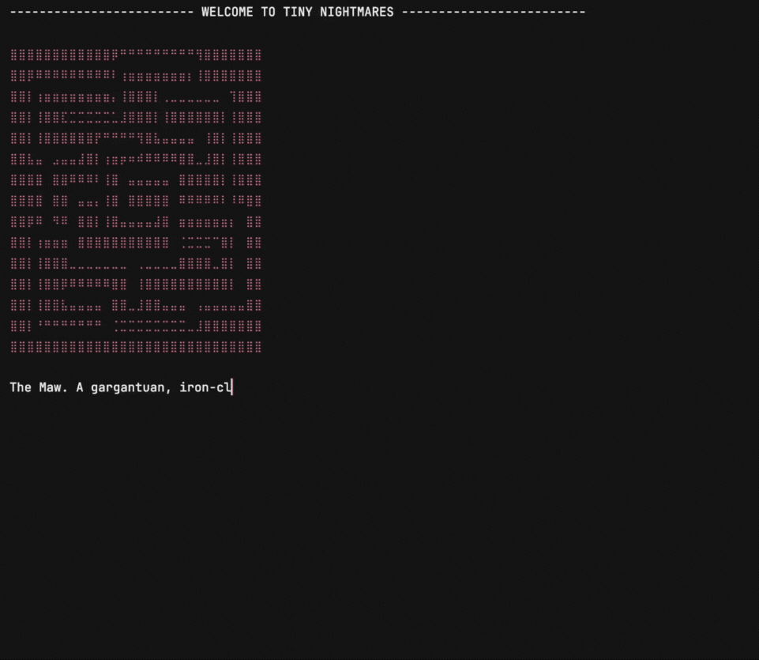
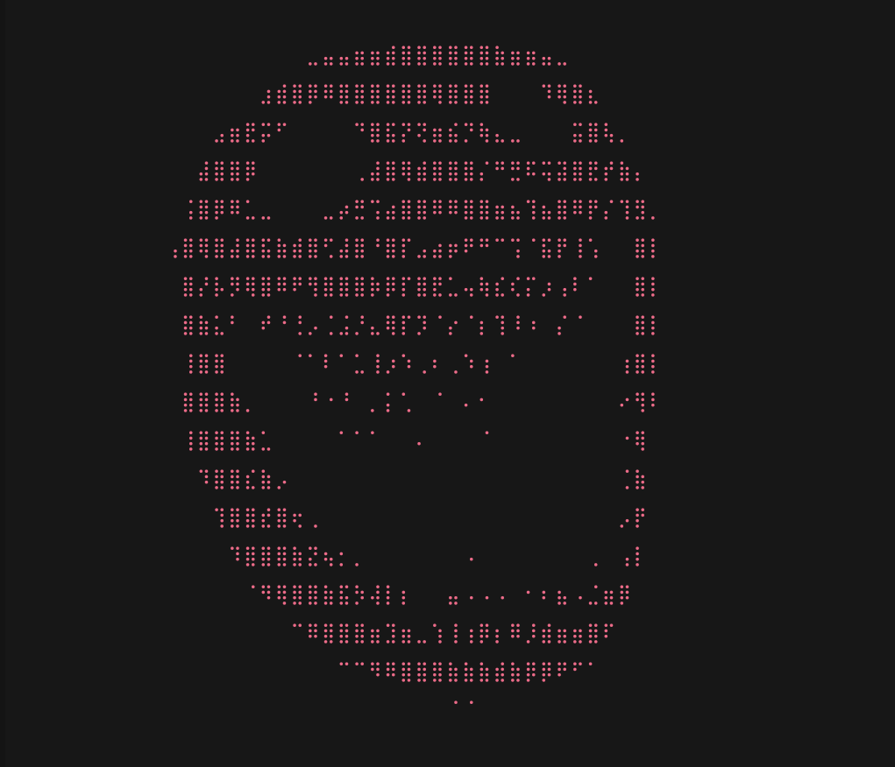

# Tiny Nightmares: A Text-Based RPG



This is a text-based adventure RPG where you explore the dark and dangerous corridors of **The Maw**! Survive, fight, and discover the path to freedom in this labyrinth of horrors.


## How to Play

1. **Compile and Run the Game**  
   Make sure you have Java installed (JDK 17 or later is recommended).

2. **Navigate to the project folder and run the game using the `Main` class:**

#### - On Windows Terminal
```cmd
cd path\to\file\Tiny_Nightmares
java -cp out;src Main
```

#### - On macOS or Linux Terminal
```cmd
cd path/to/file/Tiny_Nightmares
java -cp out:src Main
```


2. **Create Your Character:**  
   - Choose from three unique hero types: **Empath**, **Shadow**, or **Tinkerer**.  
   - Enter a name for your hero (or press Enter for a default name).  
   - Select your difficulty (**Easy** or **Hard**), which will affect your creation points and starting resources.  
   - Distribute your points between **Life** and **Cunning** to shape your character's abilities.

3. **Explore The Maw:**  
   - You will start in the **Starting Chamber**.  
   - The game will display available options: check your backpack, talk to the Scavenger, and enter connected rooms.  
   - Use the numbers to select your action.

4. **Combat:**  
   - Upon entering a room with enemies, combat will automatically initiate.  
   - Choose your actions: **Basic Attack**, **Special Attack**, **Use Consumable**, or **Flee**.  
   - Special attacks are one-time use per combat.  
   - Be strategic to defeat your foes!

5. **Scavenger (Shopkeeper):**  
   - In the **Starting Chamber** you can find the **Scavenger**.  
   - He sells weapons, potions, and confrontation consumables in exchange for **Fingernail Scraps** (the game's currency).

6. **Backpack:**  
   - At any time, you can access your backpack to use potions or confrontation consumables.

7. **Fleeing:**  
   - If combat becomes too challenging, you can attempt to flee, will will have 50% chance to succeed.  
   - A successful escape will return you to the **Starting Chamber**.

8. **Objective:**  
   - Your ultimate goal is to find the **Exit** and escape The Maw!


## The Labyrinth

The Maw is a treacherous place. There's in total 17 rooms you can explore.


## Enemies



Beware of the dangers lurking within The Maw. Different enemies inhabit various rooms, each with their own characteristics:

- **Rats**: Small, but surprisingly menacing.  
- **Spiders**: Agile and potentially venomous.  
- **The Janitor**: A sturdy and relentless opponent.  
- **The Chef**: Watch out for their "culinary" skills and combat prowess.


## Win and Lose Conditions

- **Win:** Reach the **Exit**.  
- **Lose:** Your life reaches zero during combat.


## Technologies Used

- Java


Good luck on your adventure through **The Maw**!  


## About This Project

This game was developed for the **Object-Oriented Programming** subject for the course **Software Developer** taught by **Professor Vitor Santos** at **Casae Digital**.

**Tiny Nightmares** is heavily inspired by the atmosphere and themes of *Little Nightmares*, a game I deeply admire for its storytelling, eerie environments, and emotional undertones. I wanted to bring a bit of that dark, mysterious world into a text-based RPG format, using Java and core object-oriented principles such as **encapsulation**, **inheritance**, and **polymorphism**.

Thank you for checking it out! 💻🕹️

> Download the game here: https://drive.google.com/file/d/1BsfA26TghrB9s5_Gcku5nSsLC9uHW5C0/view?usp=sharing

